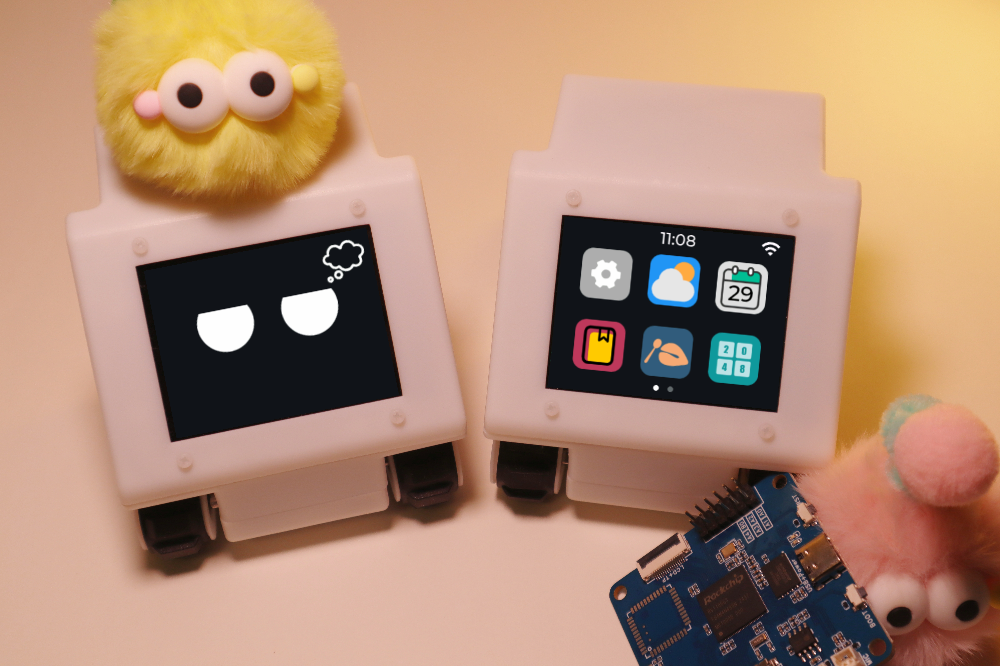
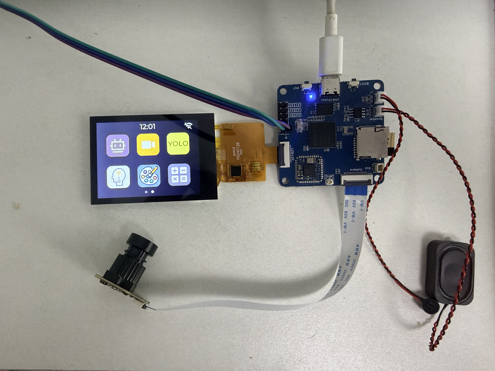
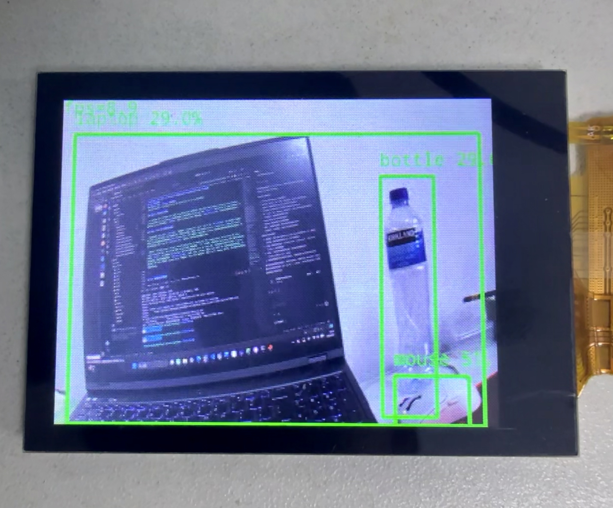

<h1 align="center">RV1106-Edge-Vision-System</h1>

<p align="center">基于 Rockchip RV1106 的端侧视觉、Linux BSP 与嵌入式图形显示系统</p>

<p align="center">
  
  
  
  
  
  
</p>

<p align="center">
  
</p>

## 项目简介

RV1106-Edge-Vision-System 是在 [Echo-Mate](https://github.com/No-Chicken/Echo-Mate) 开源项目基础上持续开发的 RV1106 全栈嵌入式项目。它不只包含一个桌面机器人应用，还覆盖了从板级启动、设备树与 Buildroot 集成，到摄像头媒体链路、RKNN 推理以及 DRM/KMS 显示驱动的完整工程路径。

本项目当前完成的核心工作包括：

- 完成 RV1106 板级 Bring-up 基线，梳理 U-Boot、Linux Kernel、设备树、Buildroot、分区和启动服务。
- 将 YOLO 主采集与预处理链路从 OpenCV `VideoCapture` / CPU `resize` 迁移到 RV1106 原生 VI、VPSS 和 DMABUF。
- 将 ST7789V 显示从 `fbdev/fbtft` 迁移到 DRM/KMS、TinyDRM 和 `mipi-dbi` 公共辅助层。
- 将 LVGL 应用显示端切换为 `/dev/dri/card0`，使用 RGB565 双 dumb buffer 和 atomic commit。
- 保留天气、日历、计算器、画板、小游戏、AI 对话和 YOLO 目标检测等 DeskBot 功能。
- 保存构建、板端验证、性能采样与故障复盘记录，形成可复现的工程文档。

> 当前状态：VI/VPSS/RKNN 与 ST7789V DRM 链路均已完成板端验证；最新一轮完整 BSP 集成镜像已通过主机侧构建与打包检查，仍需重新烧录后补齐该镜像的最终板端启动证据。

## 系统架构

```text
SC3336 Camera
  │  2304×1296 RAW10 @ 25 FPS
  ▼
MIPI CSI-2 → RKISP
  ▼
VI: 864×480 NV12 MB/DMABUF
  │  RK_MPI_SYS_Bind
  ▼
VPSS: 640×640 RGB888
  ▼
Bounded latest-wins queue (capacity = 2)
  ▼
RKNN zero-copy input → YOLOv5 inference → post-process / NMS
  ▼
OpenCV drawing and RGB565 conversion
  ▼
LVGL RGB565 double buffer
  ▼
libdrm atomic commit → /dev/dri/card0
  ▼
DRM Tiny Driver → drm_mipi_dbi → SPI0
  ▼
ST7789V: logical 320×240, rotation 270°
```

这里的“zero-copy”特指 VPSS 输出 MB 通过 DMABUF fd 绑定为 RKNN 输入内存。检测框绘制、最终缩放和 RGB565 转换仍由 CPU/OpenCV 完成，因此当前实现不是从摄像头到显示面板的全链路零拷贝。

<!-- IMAGE REQUEST (optional): assets/readme/system-pipeline.svg
建议提供一张横向 1600×700 左右的架构图，内容对应上面的 Camera→VI→VPSS→RKNN→LVGL→DRM→LCD 链路；浅色或透明背景，适合 GitHub README。
-->

## 主要硬件与软件栈

| 层级 | 当前配置 |
| --- | --- |
| SoC | Rockchip RV1106 |
| Camera | SC3336，2304×1296 RAW10 @ 25 FPS |
| Display | ST7789V，SPI0 CS0，最高 60 MHz，RGB565 |
| Display mode | 面板原生 240×320，旋转 270°，逻辑分辨率 320×240 |
| Boot / OS | U-Boot、Linux 5.10.110、Buildroot |
| Media | RKAIQ、RKMPI VI/VPSS、MB/DMABUF、RGA |
| AI | RKNN Runtime、YOLOv5 |
| GUI | LVGL 9.2.3、DRM/KMS、libdrm |
| Application | C/C++、CMake、pthread、OpenCV-mobile |

## 已完成的工程工作

### 1. RV1106 BSP Bring-up 与系统集成

Bring-up 工作覆盖了完整启动链，而不是只验证单一外设：

- 固化 Echo-Mate 板级 `BoardConfig`、SD 卡启动方式和分区布局。
- 完成 U-Boot、Kernel、DTB、Buildroot rootfs 和 `update.img` 的主机侧编译与打包。
- 以“设备树解析 → 总线枚举 → 驱动匹配 → `probe`”为主线检查启动过程。
- 清理摄像头设备树：同一 I2C4 地址 `0x30` 仅保留 SC3336，禁用冲突的 SC4336/SC530AI，并移除悬空 media endpoint。
- Kernel 配置只保留实际使用的 SC3336 模块，IQ 文件同步收敛到 SC3336。
- 补齐 DeskBot 的 Buildroot 依赖、OEM 打包和启动服务，应用安装到 `/oem/usr/share/deskbot`。
- 使用 `/userdata/deskbot` 保存运行日志和可写配置，将运行状态与 `/oem` 中的打包产物分离。
- 通过 `RkLunch.sh` 提供 `start`、`stop`、`restart` 和 `status` 生命周期管理。

原项目功能、SD 卡启动、GUI、摄像头和 YOLO 已在板端完成基线复现。当前工作区生成的最新整包固件仍需重新烧录，以补齐该版本的 Kernel probe、media graph 和开机自启动验证。

一次完整串口重启进一步确认了当前板端启动链：

```text
DDR3 128 MiB
→ U-Boot SPL 2017.09 (Aug 26 2026)
→ U-Boot 2017.09 (Aug 26 2026)
→ SD/MMC 启动，FIT Kernel 与 DTB SHA-256 校验通过
→ Device Tree model: Echo Mate
→ Linux 5.10.110 #5 (Aug 27 2026)
→ CMA reserved: 67584 KiB
→ /dev/mmcblk1p7 以 EXT4 挂载为根文件系统
→ ST7789V DRM 初始化并创建 /dev/dri/card0
→ SC3336、CSI2 DPHY、RKCIF、RKISP、RGA、RKNPU 初始化
→ deskbot: started (pid 258)
→ Buildroot login prompt
```

当前板端是分阶段更新后的运行组合；上述记录证明现有 U-Boot、独立 DRM `boot.img`、rootfs/OEM 和 DeskBot 可以完成闭环启动，但不替代后续对最新重新打包 `update.img` 的整包烧录验收。

已归档的 SC3336 板端证据摘要：

```text
I2C binding         /sys/bus/i2c/devices/4-0030/name → sc3336
Sensor entity       m00_b_sc3336 4-0030 → /dev/v4l-subdev2
Sensor format       2304×1296 SBGGR10 @ 25 FPS
RKCIF controller    /dev/media0，RAW node /dev/video0
RKISP controller    /dev/media1，mainpath /dev/video11
Legacy YOLO input   /dev/video11，864×480 NV21（OpenCV 基线链路）
```

本轮板端 `media-ctl` 输出进一步确认了当前两张 media controller 及其关键 enabled link：

```text
/dev/media0: driver=rkcif, model=rkcif-mipi-lvds
  m00_b_sc3336 4-0030
    → rockchip-csi2-dphy0       [ENABLED]
      → rockchip-mipi-csi2      [ENABLED]
        → stream_cif_mipi_id0
          → /dev/video0         [ENABLED]

/dev/media1: driver=rkisp-vir0, model=rkisp0
  rkcif-mipi-lvds
    → rkisp-isp-subdev          [ENABLED]
      → rkisp_mainpath
        → /dev/video11          [ENABLED]
      → rkisp-statistics
        → /dev/video19          [ENABLED]
  rkisp-input-params /dev/video20
    → rkisp-isp-subdev          [ENABLED]
```

这证明 sensor、CSI-2 接收、RKCIF bridge、RKISP mainpath 和 3A statistics/input-params 拓扑均已建立。`[ENABLED]` 表示 media link 已启用，并不代表列出的所有 `/dev/video*` 节点正在同时采流。最新完整串口日志进一步捕获到：

```text
sc3336 4-0030: driver version: 00.01.01
sc3336 4-0030: Detected OV00cc41 sensor
rockchip-csi2-dphy csi2-dphy0: dphy0 matches m00_b_sc3336 4-0030
rkcif-mipi-lvds: Async subdev notifier completed
rkisp-vir0: Async subdev notifier completed
```

因此 SC3336 的 sensor ID 检查和异步 media subdev 绑定都有直接运行日志支持。RKCIF 在约 3.12 秒时出现的 `get remote sensor_sd failed` 发生在 sensor/DPHY 尚未完成异步注册之前；随后 DPHY match、RKCIF/RKISP notifier 均完成，media graph 和稳定出流正常，所以它属于启动顺序中的瞬态日志，而不是最终 probe 失败。历史原始证据见 [SC3336 主机与板端现状记录](./docs/logs/sc3336/2026-08-26/stage0_host_inventory.md) 和 [media graph 原始输出](./docs/logs/baseline/2026-07-08/board_camera_media.txt)。

OEM 启动与应用接管也已通过板端检查：

```text
RkLunch service   deskbot: running (pid 258)
Executable        /oem/usr/share/deskbot/main
Display fd        fd 3 → /dev/dri/card0
Runtime log       /userdata/deskbot/deskbot.log
```

这组证据确认 `RkLunch.sh` 能够拉起 OEM 中的正式 DeskBot 程序，且运行进程直接持有 DRM 设备，而不是旧 `/dev/fb0`。

<!-- IMAGE REQUEST (optional): assets/readme/bringup-evidence.png
建议提供一张 1600×900 左右的终端截图拼图：启动日志、SC3336 probe、media graph、RkLunch status。请隐藏 Wi-Fi 密码、API Key、IP 等敏感信息。
-->

### 2. VI / VPSS / RKNN 视觉链路

原 YOLO 页面通过 OpenCV `cv::VideoCapture` 获取 V4L2 图像，再在 CPU 上完成输入缩放。当前主链路改为：

```text
SC3336 → RKISP → VI → bind → VPSS → MB/DMABUF → RKNN
```

关键实现包括：

- VI 输出 864×480 NV12，VPSS 直接生成 640×640 RGB888 推理输入。
- VI 与 VPSS 通过 `RK_MPI_SYS_Bind` 连接，减少应用层中转。
- VPSS 输出 MB 获取 DMABUF fd，并通过 `rknn_create_mem_from_fd` / `rknn_set_io_mem` 绑定 RKNN 输入。
- 使用容量为 2 的 latest-wins 有界队列，优先处理最新帧，限制排队时延。
- 明确每个媒体帧的所有权，保证 `GetChnFrame` 与 `ReleaseChnFrame` 成对执行。
- 采集超时为 200 ms；连续超时达到阈值后重建媒体链路，最多尝试 3 次。
- RGB565 双缓冲配合序列号发布完整帧，LVGL 只读取已完成的前台缓冲。
- 保留 OpenCV 后端作为回退路径，可通过运行时配置选择 `auto`、`rkmpi` 或 `opencv`。

板端运行日志确认 RKISP 找到 `m00_b_sc3336 4-0030`，VI/VPSS 以预期参数启动：

```text
sensor name = m00_b_sc3336 4-0030
[rk_media] VI(0,0,0) 864x480 NV12
           → VPSS(0,0) 640x640 RGB888
           queue=2, timeout=200ms
```

一次 211.912 秒、包含正常退出的 YOLO 运行结果如下：

| 指标 | 结果 |
| --- | ---: |
| 完成推理帧数 | 1861 |
| 发布帧数 / warmup | 1891 / 30 |
| 有效推理 FPS | 8.987 |
| VI 获取帧数 | 5263，约 24.84 FPS |
| 端到端延迟 | 平均 172.985 ms，P95 190 ms |
| RKNN 推理延迟 | 平均 89.478 ms，P95 94 ms |
| 队列等待 | 平均 60.055 ms，P95 76 ms |
| latest-wins 丢弃 | 3370 帧 |
| timeout / recovery / failure | 0 / 0 / 0 |
| media PTS / software timestamp | 1861 / 0 |

退出 YOLO 时日志显示 `ispStreamOff done` 并关闭 V4L2 device，最终统计为 `final=1`。上述端到端延迟从 media PTS 统计到 RGB565 帧发布，不包含 LVGL 调度、DRM/SPI 传输和 LCD 光学响应。队列丢弃是 latest-wins 策略的预期行为，不等同于媒体链路故障。

### 3. ST7789V：FBDEV → DRM/KMS

显示链路由旧的 framebuffer 路径：

```text
DeskBot → LVGL fbdev → /dev/fb0 → fbtft/fb_st7789v → SPI0 → ST7789V
```

迁移为：

```text
DeskBot → LVGL DRM → libdrm → /dev/dri/card0
        → DRM/KMS → st7789v-dbi → drm_mipi_dbi → SPI0 → ST7789V
```

驱动与系统侧完成了以下改造：

- 新增 DRM tiny driver：`drivers/gpu/drm/tiny/st7789v.c`。
- 复用 Linux `drm_mipi_dbi` 公共辅助层，集中处理 DBI 命令、窗口更新和 framebuffer flush。
- 新增设备树 compatible `sitronix,st7789v-dbi`，复用原板 DC、reset、backlight 与 SPI 参数。
- 启用 `CONFIG_TINYDRM_ST7789V=y`，关闭 `CONFIG_FB_TFT`，解除旧 fbtft 驱动绑定。
- 应用使用 `/dev/dri/card0`、RGB565 双 dumb buffer 和 atomic commit。
- 保留 `CONFIG_FB=y` 供 DRM fbdev emulation 使用，因此系统仍可能出现 `/dev/fb0`，但 DeskBot 不再打开它。

迁移前从已正常工作的 FB 驱动中固化了以下硬件基准，并在新 DRM 驱动中保持一致：

| 项目 | 迁移基准 |
| --- | --- |
| SPI | SPI0 CS0；短命令最高 10 MHz，像素传输使用 DTS 的 60 MHz 配置上限 |
| DC | GPIO1_D0；物理低为 command，物理高为 data |
| Reset | GPIO1_C4，active-low；物理拉低 20～40 µs，释放后等待 120 ms |
| Mode | 原生 240×320；旋转后逻辑 320×240，16 bpp，stride 640 |
| Rotation | 270°，MADCTL=`0x60`（MV + MX） |
| Color | RGB565，BGR bit 未设置 |
| Offset | 0/0；窗口 X=0..319、Y=0..239 |
| Backlight | PWM9 `pwm-backlight` |
| Init | 保留 `Sleep Out`、`COLMOD=0x05`、PORCTRL、GCTRL、VCOM、Power、Gamma、`Display On` 等已验证参数 |

60 MHz 是软件配置上限，并非逻辑分析仪实测 SCLK；reset 和 DC 时序同样来自代码审计与稳定点屏结果，尚无物理波形记录。

首版 DRM 镜像曾出现花屏和：

```text
[drm] *ERROR* Failed to update display -22
```

根因是 Rockchip SPI 控制器报告的单次最大传输长度为 `65535` 字节，而 RGB565 以 16 bit word 传输，chunk 长度必须为偶数。最终在 `drm_mipi_dbi` flush 路径中将 chunk 上限向下对齐到 2 字节，整帧按 `65534 + 65534 + 22532` 字节发送，错误和花屏均消失。

板端已确认：

- `/dev/dri/card0` 和 `card0-SPI-1` 存在，connector 状态为 `connected`。
- DRM mode 为 320×240，颜色、方向和 offset 正常。
- 无明显撕裂、闪烁或花屏，内核不再出现 `Failed to update display`。
- Home 与 YOLO 页面分别持续刷新约 30 分钟正常。
- 多次进入和退出 YOLO 页面正常，应用进程 fd 实际指向 `/dev/dri/card0`。

单轮同条件 A/B 采样如下：

| 场景 / 指标 | 旧 FB | DRM | 说明 |
| --- | ---: | ---: | --- |
| Home 进程 CPU | 3.00% | 2.96% | 基本持平 |
| Home 系统 busy | 7.64% | 6.83% | DRM 样本较低 |
| YOLO 进程 CPU | 35.71% | 36.22% | 基本持平 |
| YOLO 系统 busy | 51.19% | 39.81% | DRM 样本较低 |
| YOLO FPS | 8.889 | 8.807 | 基本持平 |
| YOLO E2E P95 | 193 ms | 191 ms | 基本持平 |

该结果只用于记录当前趋势，不作为最终性能结论：样本只有一轮，旧 FB 侧开启了 fbtft debug 日志，内存样本顺序也不完全一致。完整对比方法、原始数据和限制见 [ST7789V FB → DRM 迁移报告](./docs/ST7789V_FB_to_DRM_Migration.md)。

## 功能界面

DeskBot 当前包含 Home、YOLO、AI Chat、天气、日历、计算器、画板、设置、2048、记忆游戏和木鱼等页面。

<p align="center">
  
  
</p>

<p align="center">
  <sub>左：RV1106 + ST7789V DRM/KMS Home 实机界面　　右：SC3336 + VI/VPSS + RKNN YOLO 实时检测</sub>
</p>

两张实拍图分别确认了 DRM 模式下的 320×240 Home 页面，以及原生 VI/VPSS/RKNN 链路下的 YOLO 检测画面；屏幕方向、颜色和显示区域均正常。

## 仓库结构

```text
RV1106-Edge-Vision-System/
├── Demo/
│   ├── DeskBot_demo/             # LVGL 桌面机器人主应用
│   ├── yolov5_demo/              # RKNN、VI/VPSS 与 YOLO 实现
│   ├── AIChat_demo/              # AI 语音助手客户端/服务端
│   ├── rkmpi_demos/              # Rockchip Media 示例
│   └── lvgl_demo/                # LVGL 独立示例
├── SDK/
│   ├── rv1106-sdk/               # U-Boot、Kernel、Buildroot、Media 与固件构建
│   └── README.md                 # SDK 使用说明
├── docs/
│   ├── BSP_BRINGUP.md            # BSP Bring-up 与系统集成复盘
│   ├── VI_VPSS_RKNN_SUMMARY.md   # 原生视觉链路总结
│   ├── ST7789V_FB_to_DRM_Migration.md
│   ├── BASELINE.md               # 原始功能与性能基线
│   ├── ROADMAP.md                # 阶段路线图
│   ├── PROGRESS.md               # 实施、验证和遗留问题日志
│   └── logs/                     # 板端原始日志与采样记录
└── assets/                       # README 与项目图片
```

## 获取代码

推荐开发环境为 Ubuntu 22.04 LTS。

```bash
git clone https://github.com/wangyizhen0629-collab/RV1106-Edge-Vision-System.git
cd RV1106-Edge-Vision-System
git submodule update --init --recursive
git lfs pull
```

SDK 环境与基础依赖详见 [SDK/README.md](./SDK/README.md)。

## 构建与运行

### x86 LVGL 仿真

先将 `Demo/DeskBot_demo/conf/dev_conf.h` 中的 `LV_USE_SIMULATOR` 设置为 `1`，再使用独立的桌面构建目录：

```bash
cmake -S Demo/DeskBot_demo -B Demo/DeskBot_demo/build
cmake --build Demo/DeskBot_demo/build -j4
cd Demo/DeskBot_demo/bin
./main
```

### RV1106 ARM 交叉编译

确认 `LV_USE_SIMULATOR` 为 `0`。ARM 构建必须使用独立目录，不能复用 x86 CMake cache：

```bash
cmake -S Demo/DeskBot_demo \
  -B Demo/DeskBot_demo/build-arm \
  -DTARGET_ARM=ON \
  -DCMAKE_BUILD_TYPE=Release

cmake --build Demo/DeskBot_demo/build-arm --target main -j4
```

构建产物及其依赖资源位于 `Demo/DeskBot_demo/bin/`。该目录可单独传到开发板运行，不需要为每次应用改动重新烧录固件：

```bash
scp -r Demo/DeskBot_demo/bin root@<board-ip>:/tmp/deskbot
```

开发板执行：

```bash
cd /tmp/deskbot
DESKBOT_CAMERA_BACKEND=rkmpi ./main
```

正式固件中的应用由 `/oem/usr/bin/RkLunch.sh` 管理，默认目录为 `/oem/usr/share/deskbot`，日志位于 `/userdata/deskbot/deskbot.log`。

### 完整 SDK / 固件构建

只有修改 U-Boot、Kernel、设备树、Buildroot 或 OEM 打包时才需要重新构建并烧录固件：

```bash
cd SDK/rv1106-sdk
./build.sh lunch
./build.sh
```

选择 Echo-Mate 对应 BoardConfig。构建生成的镜像应在烧录前记录文件大小与 SHA-256，烧录后再完成启动日志、驱动 probe、media graph 和应用自启动验证。

## 板端验证

### DRM 显示

```bash
dmesg | grep -i -E 'st7789|drm|spi|failed to update'
readlink /sys/bus/spi/devices/spi0.0/driver
ls -l /dev/dri /sys/class/drm
cat /sys/class/drm/card*-*/status
cat /sys/class/drm/card*-*/modes
cat /sys/class/graphics/fb0/name
```

应用启动后可确认实际打开的显示设备：

```bash
pid="$(cat /var/run/deskbot.pid)"
ls -l "/proc/$pid/fd" | grep -E 'dri|fb'
```

预期结果是应用 fd 指向 `/dev/dri/card0`；即使 DRM fbdev emulation 创建了 `/dev/fb0`，应用也不应打开它。

### Camera / VI / VPSS / RKNN

```bash
dmesg | grep -i -E 'sc3336|rkcif|rkisp|mipi|failed|error'
ls -l /dev/video* /dev/media* /dev/v4l-subdev* 2>/dev/null
/oem/usr/bin/RkLunch.sh status
tail -f /userdata/deskbot/deskbot.log
```

日志中的 `[ai_camera_metrics]` 可用于检查有效 FPS、推理延迟、队列等待、丢弃、超时、恢复和失败计数。

## 文档索引

- [BSP Bring-up 与系统集成](./docs/BSP_BRINGUP.md)
- [VI / VPSS / RKNN 原生视觉链路总结](./docs/VI_VPSS_RKNN_SUMMARY.md)
- [ST7789V FB → DRM 迁移报告](./docs/ST7789V_FB_to_DRM_Migration.md)
- [项目基线](./docs/BASELINE.md)
- [开发路线](./docs/ROADMAP.md)
- [实施进度与验证记录](./docs/PROGRESS.md)
- [DeskBot 架构说明](./Demo/DeskBot_demo/docs/ARCHITECTURE_SPEC.md)

## 当前限制与后续计划

- 对最新重新打包的 `update.img` 执行整包烧录，补齐该整包对应的 Kernel probe、media graph 和开机自启动证据。
- SC3336 当前可以正常识别和出流，但启动日志仍显示缺少 `reset-gpios`、default/sleep pinstate，并使用 dummy regulator；需要结合原理图继续确认物理 reset/PWDN 与供电控制语义。
- 补采 VI/VPSS 链路的稳定态 CPU、RSS/峰值内存及 2 小时、8 小时长稳数据。
- 继续减少 YOLO 后处理、画框、缩放和 RGB565 转换中的 CPU 拷贝。
- 分析压力场景下 `CmaFree: 0 kB` 的根因，明确 DRM dumb buffer、RKNN 和媒体缓冲的 CMA 使用关系。
- 在统一镜像、统一场景和多轮测试条件下完成最终 FB/DRM 与视觉链路性能报告。
- 如需物理级无撕裂结论，补充 TE 信号或逻辑分析仪测量；当前结论为肉眼长稳验证无明显撕裂。

## 开源来源与致谢

本项目基于 Echo-Mate 开源软硬件继续开发，感谢原作者及 Rockchip、Luckfox、LVGL、Linux DRM、RKNN、OpenCV 等开源项目与生态贡献者。

- Echo-Mate 原项目：[No-Chicken/Echo-Mate](https://github.com/No-Chicken/Echo-Mate)
- 硬件开源页面：[立创开源广场](https://oshwhub.com/no_chicken/ai-desktop-robot-echo)
- 原项目演示视频：[哔哩哔哩](https://www.bilibili.com/video/BV161ZaYyEmF/)
- 原项目手册：[no-chicken.xyz](https://no-chicken.xyz/)

## License

本仓库沿用 [GPL-3.0 License](./LICENSE)。第三方组件、模型和二进制库可能适用各自的许可证，使用和再分发前请分别核对。
